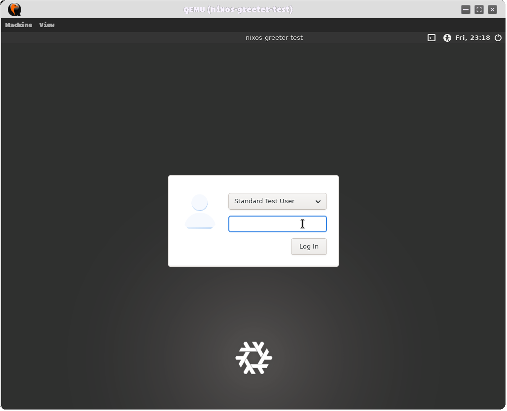

# LightDM Greeter Ganapati



A modern, graphical login manager/greeter rewritten in Go, optimized for lightning-fast performance, Wayland & X11 support, GTK theme/wallpaper integration, and a polished Libadwaita-inspired aesthetic.


## the Remover of Obstacles

 


## Features
- **Fast & Minimal**: Written in Go with minimal runtime dependencies.
- **Protocol Agnostic**: Supports both Wayland and X11 session selection natively.
- **Stylix & GTK Integration**: Automatically inherits wallpapers, GTK theme names, and dark/light mode polarities from **Stylix** out of the box with zero redundant configuration.
- **NixOS Flake Native**: Includes a built-in NixOS module (`nixosModules.default`), development shell, and QEMU virtual machine test suite.
- **Testable**: Supports headless build tags for CI/CD and unit testing without CGO/graphical dependencies.

## Prerequisites
- Nix package manager (with flakes enabled)
- QEMU (for local VM testing)

## Quick Start
Initialize and enter the development environment:
```bash
git clone <url>
cd LightDM_Elephant_Fork
nix develop
```

## Building & Testing

We use a `justfile` to standardize the development workflow:

| Command | Description |
| :--- | :--- |
| `just test` | Run unit and D-Bus state-machine tests. |
| `just build` | Compile the full graphical binary (requires graphics libs). |
| `just build-headless` | Compile the portable headless CLI/TUI binary (zero CGO dependencies). |
| `just vm-build` | Build the integrated NixOS QEMU testing VM. |
| `just vm-run` | Run the compiled NixOS QEMU VM live. |

## NixOS Configuration (For Flake & Stylix Users)

To add LightDM Greeter Ganapati as your system's default display manager using Nix flakes:

1. **Add the flake input** in your system's `flake.nix`:
   ```nix
   inputs.greeter-ganapati.url = "github:max-moser/lightdm-greeter-ganapati";
   ```

2. **Import the NixOS module** in your `configuration.nix`:
   ```nix
   imports = [
     inputs.greeter-ganapati.nixosModules.default
   ];

   # Enable the greeter
   services.xserver.displayManager.lightdm.greeters.ganapati.enable = true;
   ```

> **Stylix Integration**: If you use **Stylix**, Greeter Ganapati will **automatically** inherit your system wallpaper (`config.stylix.image`), GTK theme name (`config.gtk.theme.name`), and dark mode preference (`config.stylix.polarity`) with zero redundant setup! You can also manually override them:
> ```nix
> services.xserver.displayManager.lightdm.greeters.ganapati = {
>   enable = true;
>   themeName = "CustomTheme";
>   wallpaper = ./custom-wallpaper.png;
> };
> ```

## Configuration File
The greeter reads its INI configuration from `/etc/lightdm/lightdm-greeter-ganapati.conf`:
```ini
[GTK]
gtk-theme-name=Adwaita-dark
gtk-application-prefer-dark-theme=true

[Greeter]
default-session=awesome
background=/path/to/wallpaper.png
```

## Styling & Theme Binding
The greeter implements the standard Libadwaita dark theme palette by default, adapting to user preferences:
- **Background**: `#242424` (or custom wallpaper / Stylix image)
- **Accent (Blue)**: `#3584e4`
- **Panel Grey**: `#303030`
- **Text**: `#ffffff`

## Project Architecture
- `cmd/lightdm-greeter-ganapati/`: Main entrypoint application orchestrator.
- `pkg/config/`: INI configuration loader (supporting wallpapers and Stylix/GTK theme bindings).
- `pkg/dbus/`: LightDM D-Bus integration and state machine.
- `pkg/ui/`: Gio-based graphical layout (with Slick Greeter aesthetic) and headless TUI fallback.
